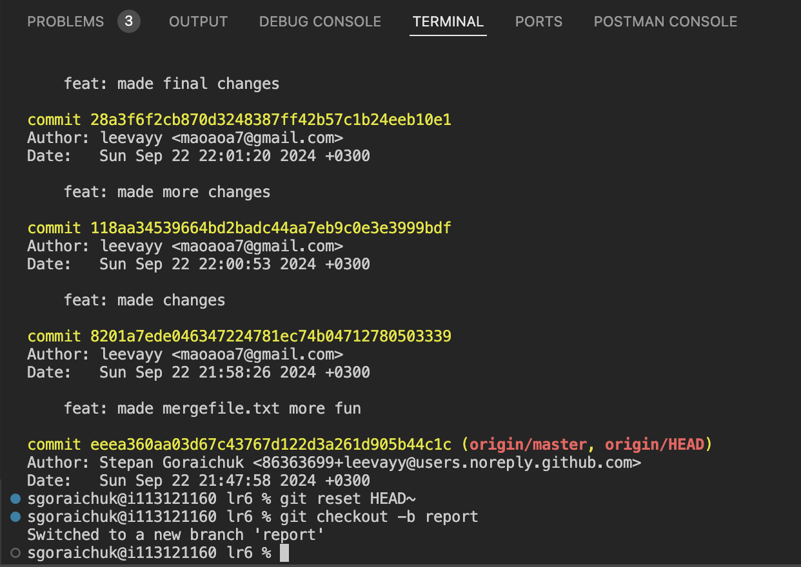
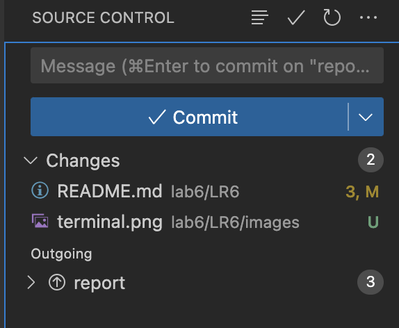
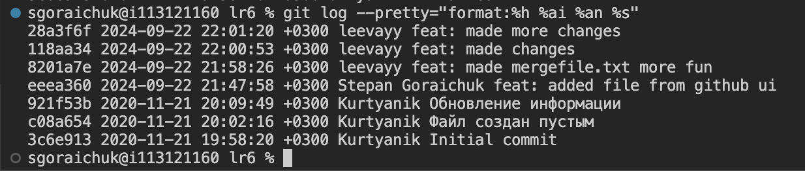

# LR6

## Лабораторная работа №6

### Цель лабораторной работы

изучение базовых возможностей системы
управления версиями, опыт работы с Git Api, опыт работы с локальным и
удаленным репозиторием.

### Ход выполнения

#### Изображения


Рисунок 1 - Снимок экрана с консолью


Рисунок 2 - Снимок экрана со сторонней программой


Рисунок 3 - Снимок экрана с историей операций

#### Лог команд

```bash
1146  g++-14 -std=c++17 ./index.cpp -o ./index && ./index
 1147  cd ../lab6/
 1148  git clone https://github.com/leevayy/LR6
 1149  git pull
 1150  cd lr6
 1151  git pull
 1152  git log --branches 
 1153  git branch 
 1154  git merge master
 1155  git log -p -1
 1156  git checkout branch1
 1157  git pull branch1
 1158  git branch -a
 1159  git pull remotes/origin/branch1
 1160  git branch
 1161  git add .
 1162  git checkout -b mergefailed
 1163  git commit -m "fix: fixed mergefile.txt text" 
 1164  git checkout master 
 1165  git add .
 1166  git commit -m "feat: made mergefile.txt more fun" 
 1167  git merge mergefailed
 1168  git add .
 1169  git log 
 1170  git checkout mergefailed
 1171  git log 
 1172  git checkout master 
 1173  git branch -D mergefailed
 1174  git add .
 1175  git commit -m "feat: made changes" 
 1176  git commit -m "feat: made more changes"
 1177  git add .
 1178  git commit -m "feat: made more changes"
 1179  git add .
 1180  git commit -m "feat: made final changes"
 1181  git log 
 1182  git reset HEAD~
 1183  git checkout -b report
```


